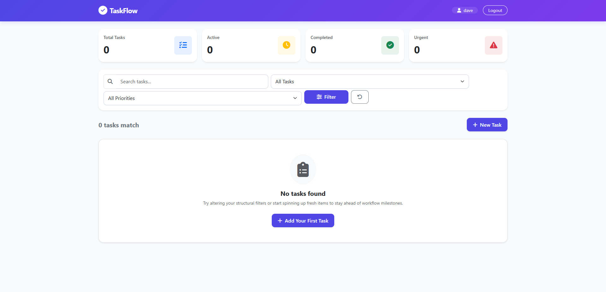
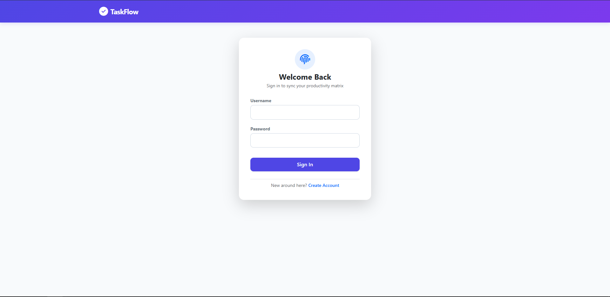
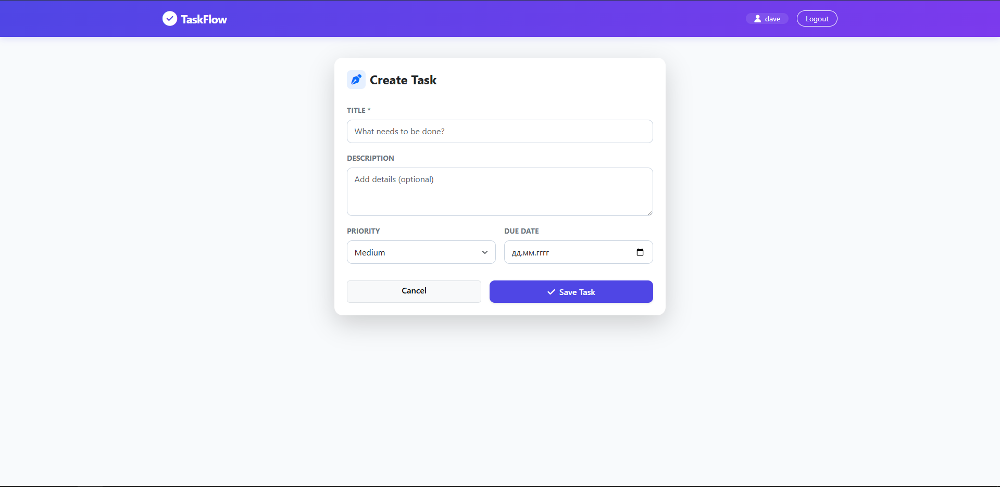

# ⚡ TaskFlow

TaskFlow is a modern, responsive, and minimalist Django-based To-Do application. Built for individual productivity, it features user authentication, dynamic task filtering, urgency metrics dashboards, and visual priority tracking.

---

## ✨ Features

* **🔒 Secure Authentication:** Built-in registration, login, and logout systems ensuring your tasks are completely private to your account.
* **📊 Dynamic Metrics Dashboard:** Real-time summary counters tracking your Total, Active, Completed, and Urgent tasks at a glance.
* **🎨 Redesigned Visual Analytics:** Clean layout accented with intuitive color-coded borders and badges based on task priorities.
* **🔍 Power Filtering & Search:** Instantly narrow down workflows by status (Active/Completed), priority level, or text-based search queries.
* **⏰ Overdue Detection:** Automated checking mechanism that visually highlights tasks that have passed their target completion due date.

---

## 📸 Screenshots

### Main Dashboard
<p align="center">
  
</p>

### User Authentication & Task Management
<p align="center">
  
  
</p>

---

## 🛠️ Technology Stack

* **Backend Framework:** Django (Python)
* **Database:** SQLite 3
* **Frontend UI:** Bootstrap 5 (with Glassmorphism accents)
* **Iconography:** FontAwesome 6

---

## 🚀 Quick Setup Guide

Get your local instance of TaskFlow up and running in less than two minutes.

### 1. Environment Setup
Clone or download this repository, navigate to the project directory, and initialize a Python virtual environment:

```bash
# Create the virtual environment
python3 -m venv venv

# Activate the environment
# On macOS/Linux:
source venv/bin/activate
# On Windows:
venv\Scripts\activate