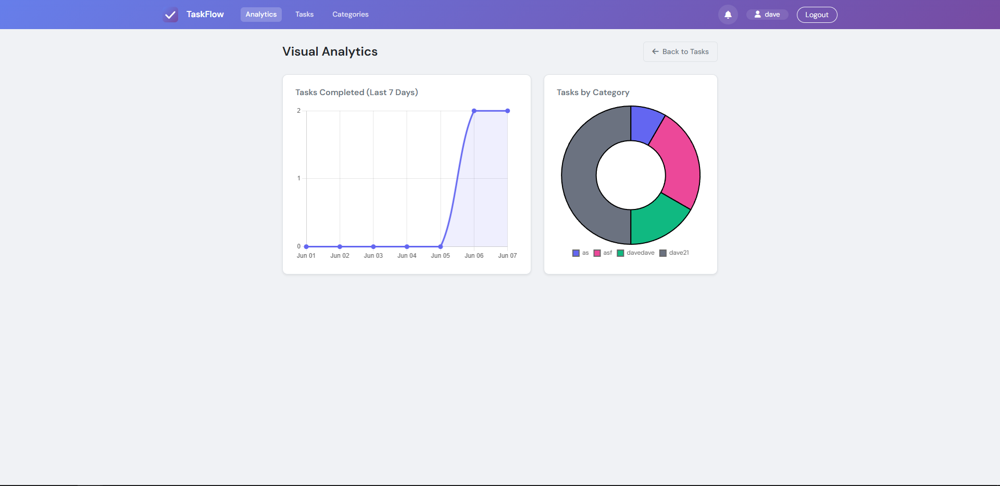
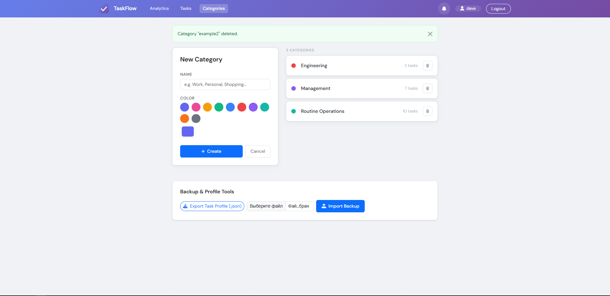

# ⚡ TaskFlow

TaskFlow is a modern, responsive, and minimalist Django-based To-Do application. Built for individual productivity, it features user authentication, dynamic task filtering, urgency metrics dashboards, visual priority tracking, and automated background reminders.

---

## ✨ Features

* **🔒 Secure Authentication:** Built-in registration, login, and logout systems ensuring your tasks are completely private to your account.
* **📊 Dynamic Metrics Dashboard:** Real-time summary counters tracking your Total, Active, Completed, and Urgent tasks at a glance.
* **🔔 Time-Sensitive Notification Engine:** Proactive background worker scans your tasks and delivers in-app alert badges and emails 24 hours and 1 hour before deadlines.
* **🎨 Redesigned Visual Analytics:** Clean layout accented with intuitive color-coded borders and badges based on task priorities.
* **🔍 Power Filtering & Search:** Instantly narrow down workflows by status (Active/Completed), priority level, category, or text-based search queries.
* **⏰ Overdue Detection:** Automated checking mechanism that visually highlights tasks that have passed their target completion due date.

---

## 📸 Screenshots

### Main Dashboard & Analytics
<p align="center">
  
</p>

<p align="center">
  
</p>

### User Authentication & Organization
<p align="center">
  
  
  
</p>

---

## 🧠 How Celery is Used

TaskFlow relies on Celery and Redis to handle time-heavy calculations asynchronously in the background so the user interface never lags.

### 🕒 Scheduled Background Workflows
The automation logic is managed through specific background task routines defined in `todos/tasks.py`:

1. **`send_deadline_reminders` (Runs every 15 minutes):** Scans the active database to find tasks approaching their deadlines. It handles creating in-app alerts and processing reminder emails at exactly the **24-hour** and **1-hour** remaining milestones.
2. **`generate_daily_overdue_digests` (Runs every morning):** Pools overdue items for each user, updates the global overdue notification log, and dispatches a comprehensive diagnostic summary email directly to the user.

## 🚀 Quick Setup Guide

Get your local instance of TaskFlow up and running smoothly by following these steps.

### 1. Environment Setup
Clone or download this repository, navigate to the project root directory, and initialize a Python virtual environment:

```bash
python3 -m venv venv
# On macOS/Linux:
source venv/bin/activate
# On Windows (Command Prompt):
venv\Scripts\activate

pip install -r requirements.txt
python manage.py makemigrations
python manage.py migrate
python manage.py runserver```

### Open New terminal 
```bash
# Using WSL / Linux / macOS:
sudo service redis-server start
# Force execution through your environment directory
venv/bin/celery -A todoproject worker --loglevel=info```

### ⚙️ Architecture Workflow
```text
[ Django Models ] ──> [ Celery Beat Clock ] ──> [ Redis Queue ] ──> [ Celery Worker ] ──> [ Live UI Notification ]